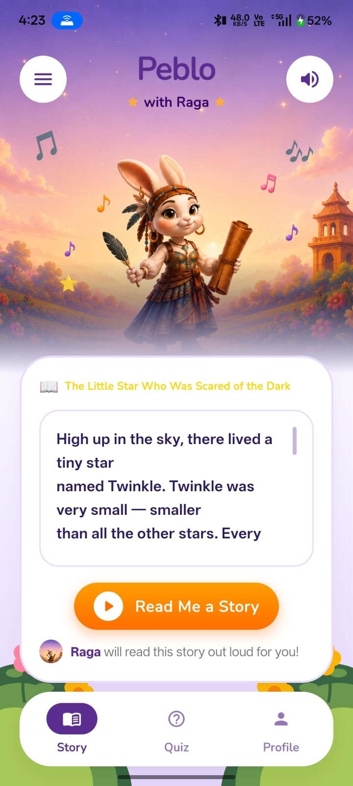
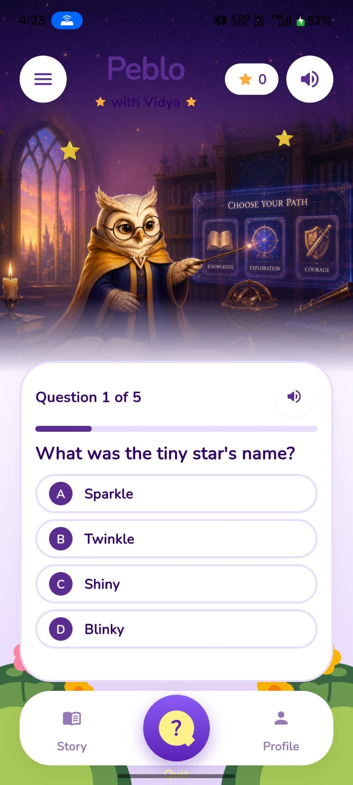
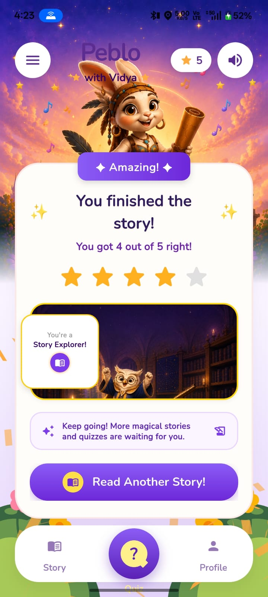

# Peblo AI Story Buddy - Interactive Learning Playground

Peblo is an AI-powered interactive learning playground built for children aged 5–12. This single-screen Flutter application showcases the seamless integration of the **Raga** (Storytelling) and **Vidya** (Quiz) worlds. It delivers a performant, child-first, offline-capable narration and comprehension quiz experience using state-driven UI interactions.

---

## 📱 App Walkthrough & Visuals

Here is the visual flow of the application showing the transitions from storytelling to the final mastery celebration screen:

| 📖 Story Reading & Audio | ❓ Interactive Quiz Screen | 🎉 Final Success Celebration |
| :---: | :---: | :---: |
|  |  |  |

---

## ✨ Key Features & Implementation

### 1. Unified State Flow & Handoff
- **Storytelling to Quiz transition**: Managed reactively via Riverpod providers. When the narration ends, `AudioState` transitions to `completed`, automatically triggering a slide-up transition of the interactive quiz card and changing the mascot's state from Raga (storyteller) to Vidya (quiz guide).
- **Dynamic Character States**: Mascots respond dynamically with custom bounce, rock, and point animations mapped to current user actions (reading, listening, choosing options, or celebrating).

### 2. High-Fidelity Studio Audio
- **Saved Audio Integration**: Built using pre-recorded high-fidelity voice acting assets to provide premium narrative tone and question delivery without relying on robotic TTS engines.
- **Precise Timing Tracking**: The audio player tracks playback position down to the second, automatically highlighting the active paragraph or scrolling to follow the narrative flow.

### 3. Professional Success Celebration Redesign
- **Mockup Accuracy**: Redesigned the success celebration card to match premium designs, adding:
  - An overlapping gradient ribbon banner ("✦ Amazing! ✦").
  - A floating "Story Explorer!" badge with a circular book icon.
  - A clean, soft purple encouragement pill with dual icons.
  - An elevated premium gradient button ("Read Another Story!").
- **Bottom Navigation Clearance**: Shifted and uplifted the success card upward to prevent overlap with the floating bottom navigation bar.
- **Top Image Viewport Tuning**: Adjusted the background crop alignment to `Alignment.topCenter` so that the rabbit mascot character's ears and head are shown clearly without cropping.

---

## 🛠️ Technology Stack & Packages

- **Core Framework**: Flutter (Dart) with sound null-safety.
- **State Management**: [Riverpod (flutter_riverpod)](https://pub.dev/packages/flutter_riverpod) for robust, unidirectional, and easily testable state flow.
- **Audio Playback**: [Just Audio](https://pub.dev/packages/just_audio) for precise stream tracking, low latency playback, and resource-efficient caching.
- **Visuals & Effects**: [Confetti](https://pub.dev/packages/confetti) for celebratory blasts on correct answers, and [Lottie](https://pub.dev/packages/lottie) for smooth vector animations.

---

## 📂 Project Directory Structure

```
lib/
├── main.dart                      # App entry point (wraps widget tree in ProviderScope)
├── app/
│   └── peblo_app.dart             # MaterialApp setup, Custom PebloTheme, and routes
├── core/
│   ├── constants/
│   │   └── buddy_assets.dart      # Static asset paths for Raga and Vidya mascots
│   ├── theme/
│   │   └── peblo_theme.dart       # Curated child-friendly color palettes and card decorators
│   └── services/
│       └── tts_service.dart       # Core audio engine handling story narration, questions, and feedback
└── features/
    └── story_buddy/
        ├── data/
        │   ├── models/
        │   │   └── quiz_model.dart # Type-safe quiz question models with data validations
        │   └── repositories/
        │       └── quiz_repository.dart# Handles reading and deserialization of the quiz dataset
        ├── presentation/
        │   ├── screens/
        │   │   └── story_buddy_screen.dart# Main layout, night-sky background, and navigation bar
        │   └── widgets/
        │       ├── buddy_character.dart# Mascot character manager with 600ms animated handoffs
        │       ├── story_card.dart# Narration text viewer with dynamic paragraph tracking
        │       ├── read_button.dart# State-driven CTA button with loading states
        │       ├── quiz_section.dart# Quiz rendering engine, confetti control, and success screen
        │       └── option_tile.dart# Answer options with 300ms shake feedback on incorrect taps
        └── providers/
            ├── audio_provider.dart# Riverpod AudioState & AudioNotifier
            ├── quiz_provider.dart # Riverpod QuizStatus, QuizState, & QuizNotifier
            └── buddy_provider.dart# Riverpod BuddyState & BuddyNotifier
```

---

## 🧠 Memory Management & Disposal Safeguards

- **Disposal Safety**: Subscriptions to audio playback position streams and player states are explicitly stored in private `StreamSubscription` objects (`_positionSub`, `_stateSub`) and cancelled on playback stop or service disposal.
- **Global Provider Refs**: Changed callback references inside streams to use Riverpod’s global class-level `Ref` rather than widget-level `WidgetRef`. This completely resolves runtime exceptions like `Bad state: Cannot use "ref" after the widget was disposed` that occur if the user navigates away or switches tabs during narration playback.

---

## 🎨 Mascot Attribution & Intellectual Property

The characters **Raga** (the storytelling buddy mascot) and **Vidya** (the quiz buddy mascot) featured throughout this application are the original characters and exclusive intellectual property of **Peblo AI** (mypeblo.com). 

These assets are used strictly with permission for the sole purpose of this Mobile App Developer assignment submission.

---

## 🚀 Getting Started & Running the App

To run the project locally, ensure you have Flutter installed on your machine (`sdk: ^3.8.1` or higher).

1. **Clone the Repository**:
   ```bash
   git clone <repository_url>
   cd peblo_ai
   ```

2. **Clean and Install Dependencies**:
   ```bash
   flutter clean
   flutter pub get
   ```

3. **Run the Application**:
   ```bash
   # Runs on connected mobile device or emulator
   flutter run
   ```
